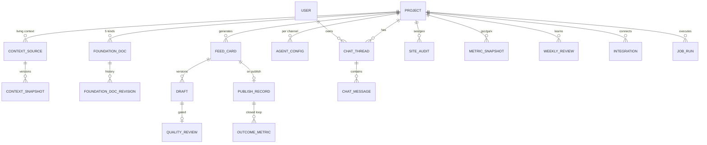

# 02 — Data Schema (Wasabi)

- source: ../teardown.md §5 (Data Model) を基に、§7 (AI-Native) の成果ループ/品質ゲート/Living Context を追加
- DB: PostgreSQL / ORM: Prisma
- 方針: internal-first のため課金系モデル(Subscription/CreditLedger)は**持たない**(teardown §8 Drop)。外販フェーズで追加

## Prisma Schema

```prisma
// ---------- 認証 (internal: 環境変数プロビジョニングの少人数チーム) ----------

model User {
  id           String   @id @default(cuid())
  email        String   @unique
  name         String
  passwordHash String   // NextAuth Credentials。将来 OAuth に置換可
  role         Role     @default(ADMIN) // internal-first: 全員ADMINでよい
  createdAt    DateTime @default(now())
  chatThreads  ChatThread[]
  approvals    FeedCard[] @relation("ApprovedBy")
}

enum Role {
  ADMIN
  MEMBER
}

// ---------- プロジェクト (teardown: PROJECT。マルチプロダクト対応) ----------

model Project {
  id              String   @id @default(cuid())
  slug            String   @unique // "shogunai"
  name            String   // "ShogunAI"
  url             String   // https://syogun.com
  status          ProjectStatus @default(ANALYZING)
  languages       String[] @default(["en", "ja"]) // 生成対象言語 [USER-REQ]
  phase           String   @default("prelaunch") // prelaunch | launched | growth — 生成の重み付けに使う
  createdAt       DateTime @default(now())
  updatedAt       DateTime @updatedAt
  contextSources  ContextSource[]
  foundationDocs  FoundationDoc[]
  agentConfigs    AgentConfig[]
  feedCards       FeedCard[]
  integrations    Integration[]
  publishRecords  PublishRecord[]
  metricSnapshots MetricSnapshot[]
  weeklyReviews   WeeklyReview[]
  chatThreads     ChatThread[]
  jobRuns         JobRun[]
  siteAudits      SiteAudit[]
}

enum ProjectStatus {
  ANALYZING   // オンボーディング解析中
  ACTIVE      // 稼働中
  PAUSED
  FAILED      // 解析失敗(リトライ可)
}

// ---------- Living Context Layer (teardown §7-1。Okara: 公開ページ1回スクレイプ → 我々: 常時接続) ----------

model ContextSource {
  id          String   @id @default(cuid())
  projectId   String
  project     Project  @relation(fields: [projectId], references: [id], onDelete: Cascade)
  kind        ContextSourceKind
  config      Json     // {url} | {repo, owner} | {path} | {propertyId} など kind別
  enabled     Boolean  @default(true)
  lastSyncAt  DateTime?
  lastDigest  String?  // 変化検知用ハッシュ(Website Refresh 相当)
  snapshots   ContextSnapshot[]
}

enum ContextSourceKind {
  WEBSITE        // 公開ページクロール (Okara同等)
  DOCUMENT       // 手動投入資料 (brand guide, positioning memo)
  GITHUB_REPO    // 自社リポジトリ (changelog, README, リリースノート)
  GSC            // Google Search Console
  GA             // Google Analytics
  USER_FEEDBACK  // App Storeレビュー/サポート会話等の貼り付け・取込 [phase2で自動化]
}

model ContextSnapshot {
  id        String   @id @default(cuid())
  sourceId  String
  source    ContextSource @relation(fields: [sourceId], references: [id], onDelete: Cascade)
  content   String   // 抽出済みテキスト(構造化はJSONでcontentMeta)
  contentMeta Json?
  createdAt DateTime @default(now())

  @@index([sourceId, createdAt])
}

// ---------- Foundation Documents (teardown: FOUNDATION_DOC。5種+自動更新) ----------

model FoundationDoc {
  id        String   @id @default(cuid())
  projectId String
  project   Project  @relation(fields: [projectId], references: [id], onDelete: Cascade)
  kind      FoundationDocKind
  content   String   // Markdown
  version   Int      @default(1)
  updatedBy String?  // userId or "agent"
  updatedAt DateTime @updatedAt
  history   FoundationDocRevision[]

  @@unique([projectId, kind])
}

enum FoundationDocKind {
  PRODUCT_DESCRIPTION
  PRODUCT_INFO
  MARKETING_STRATEGY
  COMPETITOR_ANALYSIS
  BRAND_VOICE
}

model FoundationDocRevision {
  id        String   @id @default(cuid())
  docId     String
  doc       FoundationDoc @relation(fields: [docId], references: [id], onDelete: Cascade)
  content   String
  version   Int
  updatedBy String?  // 人間編集は必ず保持し、agent更新はdiffを人間編集に重ねない (E2E-003)
  createdAt DateTime @default(now())
}

// ---------- エージェント設定 (teardown: AGENT_CONFIG + Writing Instructions) ----------

model AgentConfig {
  id           String   @id @default(cuid())
  projectId    String
  project      Project  @relation(fields: [projectId], references: [id], onDelete: Cascade)
  channel      Channel
  enabled      Boolean  @default(true)
  dailyQuota   Int      @default(1)  // 1日あたりの生成カード数
  instructions String?  // Writing Instructions (トーン・キーワード・対象subreddit等)
  voiceProfile Json?    // founderボイス学習結果 (AIF-010)
  config       Json?    // channel別 (subreddits[], keywords[], cms設定等)

  @@unique([projectId, channel])
}

enum Channel {
  X
  REDDIT
  SEO_GEO
  ARTICLE
  LAUNCH      // HN / Product Hunt [USER-REQ: B2Cローンチ]
  LINKEDIN    // phase2
  TIKTOK      // phase2
  ASO         // phase2
}

// ---------- Agents Feed (teardown: FEED_CARD。中核) ----------

model FeedCard {
  id           String   @id @default(cuid())
  projectId    String
  project      Project  @relation(fields: [projectId], references: [id], onDelete: Cascade)
  channel      Channel
  type         String   // "tweet" | "thread" | "reddit_reply" | "seo_fix" | "geo_fix" | "article" | "hn_show" | "ph_launch" ...
  title        String
  status       CardStatus @default(CURRENT)
  priority    Priority @default(MEDIUM)
  difficulty   Difficulty @default(EASY)
  language     String   @default("en")
  rationale    String?  // なぜ今この機会か(Reddit: スレッド関連性説明等)
  sourceRef    Json?    // 元スレッドURL、監査Issue、キーワード等
  approvedById String?
  approvedBy   User?    @relation("ApprovedBy", fields: [approvedById], references: [id])
  createdAt    DateTime @default(now())
  cycleId      String?  // どのJobRunで生成されたか
  drafts       Draft[]
  publishRecord PublishRecord?

  @@index([projectId, status, createdAt])
}

enum CardStatus {
  CURRENT
  DONE       // 手動完了 (Redditコピペ投稿等)
  PUBLISHED  // システム経由で配信済み
  ARCHIVED   // スキップ
}

enum Priority { HIGH MEDIUM LOW }
enum Difficulty { EASY MEDIUM HARD }

// ---------- ドラフト + 品質ゲート (teardown §7-8。編集履歴は学習素材 §7-2) ----------

model Draft {
  id         String   @id @default(cuid())
  cardId     String
  card       FeedCard @relation(fields: [cardId], references: [id], onDelete: Cascade)
  version    Int      @default(1)
  content    String   // Markdown/テキスト本文
  meta       Json?    // 記事: {targetKeyword, ogImagePrompt} / tweet: {category} 等
  authorType DraftAuthor @default(AGENT)
  createdAt  DateTime @default(now())
  qualityReview QualityReview?

  @@unique([cardId, version])
}

enum DraftAuthor {
  AGENT       // 生成
  AGENT_FIX   // 品質ゲート不合格→自動リライト
  HUMAN       // 人間編集 (ボイス学習・成果ループの一級データ)
}

model QualityReview {
  id           String  @id @default(cuid())
  draftId      String  @unique
  draft        Draft   @relation(fields: [draftId], references: [id], onDelete: Cascade)
  genericScore Int     // 0-100 (低いほどジェネリック=悪い)
  factualScore Int     // 事実性 (コンテキストとの整合)
  voiceScore   Int     // ブランドボイス適合
  communityScore Int?  // コミュニティ文化適合 (Reddit/HNのみ)
  passed       Boolean
  critique     String  // 不合格理由・改善指示
  createdAt    DateTime @default(now())
}

// ---------- 配信記録 + 成果ループ (teardown §7-2。Okaraに無い) ----------

model PublishRecord {
  id          String   @id @default(cuid())
  projectId   String
  project     Project  @relation(fields: [projectId], references: [id], onDelete: Cascade)
  cardId      String   @unique
  card        FeedCard @relation(fields: [cardId], references: [id])
  channel     Channel
  publishedAt DateTime @default(now())
  externalUrl String?  // 投稿URL / PR URL / 記事URL
  utm         String?  // 自動付与UTMパラメータ (utm_campaign=カードID)
  method      PublishMethod
  outcomes    OutcomeMetric[]
}

enum PublishMethod {
  API_X        // X OAuth投稿
  GITHUB_PR    // Coding fix
  CMS          // 記事自動公開
  MANUAL       // コピペ手動 (Reddit/HN) — externalUrlは人間が貼る
}

model OutcomeMetric {
  id         String   @id @default(cuid())
  recordId   String
  record     PublishRecord @relation(fields: [recordId], references: [id], onDelete: Cascade)
  capturedAt DateTime @default(now())
  metrics    Json     // {impressions, likes, replies, clicks, signups...} channel別
}

// ---------- サイト監査 (teardown: ANALYTICS_SNAPSHOT の SEO/GEO 部分) ----------

model SiteAudit {
  id        String   @id @default(cuid())
  projectId String
  project   Project  @relation(fields: [projectId], references: [id], onDelete: Cascade)
  kind      AuditKind
  score     Int      // 0-100
  issues    Json     // [{id, severity, page, title, detail, fixSuggestion, status}]
  createdAt DateTime @default(now())

  @@index([projectId, kind, createdAt])
}

enum AuditKind {
  SEO       // on-page / meta / CWV / sitemap / robots
  GEO       // llms.txt / schema / AI readiness / top prompts
}

// ---------- 外部指標スナップショット (GSC/GA/X) ----------

model MetricSnapshot {
  id        String   @id @default(cuid())
  projectId String
  project   Project  @relation(fields: [projectId], references: [id], onDelete: Cascade)
  source    String   // "gsc" | "ga" | "x"
  date      DateTime // 対象日
  metrics   Json     // {clicks, impressions, ctr, position} | {sessions, users} | {followers, impressions}
  createdAt DateTime @default(now())

  @@unique([projectId, source, date])
}

// ---------- 週次振り返り (teardown §7-2 成果クローズドループ) ----------

model WeeklyReview {
  id        String   @id @default(cuid())
  projectId String
  project   Project  @relation(fields: [projectId], references: [id], onDelete: Cascade)
  weekStart DateTime
  content   String   // Markdown: 何が効いたか/効かなかったか/次週の生成方針変更
  learnings Json?    // 構造化された学習 (次サイクルのプロンプトに注入される)
  createdAt DateTime @default(now())

  @@unique([projectId, weekStart])
}

// ---------- 統合 (teardown: INTEGRATION) ----------

model Integration {
  id        String   @id @default(cuid())
  projectId String
  project   Project  @relation(fields: [projectId], references: [id], onDelete: Cascade)
  kind      IntegrationKind
  status    IntegrationStatus @default(DISCONNECTED)
  config    Json?    // 暗号化トークン参照・リポジトリ名・プロパティID等 (秘匿値は環境変数/暗号化列)
  updatedAt DateTime @updatedAt

  @@unique([projectId, kind])
}

enum IntegrationKind {
  X_OAUTH
  GITHUB_APP
  GSC
  GA
  CMS_WEBHOOK   // 自社サイト構成に合わせた公開先1本 (MVP)
  SLACK_WEBHOOK // 通知 (オプション)
  TELEGRAM_BOT  // 通知 (オプション)
}

enum IntegrationStatus {
  DISCONNECTED
  CONNECTED
  ERROR       // トークン失効等 → SCR-014 で Reconnect
}

// ---------- チャット (teardown: CHAT_THREAD / MESSAGE) ----------

model ChatThread {
  id        String   @id @default(cuid())
  projectId String
  project   Project  @relation(fields: [projectId], references: [id], onDelete: Cascade)
  userId    String
  user      User     @relation(fields: [userId], references: [id])
  title     String?
  createdAt DateTime @default(now())
  messages  ChatMessage[]
}

model ChatMessage {
  id        String   @id @default(cuid())
  threadId  String
  thread    ChatThread @relation(fields: [threadId], references: [id], onDelete: Cascade)
  role      String   // "user" | "assistant"
  content   String
  contextRefs Json?  // @メンションされたコンテキスト (foundation doc kind / channel / analytics)
  createdAt DateTime @default(now())
}

// ---------- ジョブ実行 (6時間サイクル + オンデマンド) ----------

model JobRun {
  id         String   @id @default(cuid())
  projectId  String
  project    Project  @relation(fields: [projectId], references: [id], onDelete: Cascade)
  kind       JobKind
  status     JobStatus @default(RUNNING)
  log        String?   // SCR-003 の活動ログ表示に使う
  startedAt  DateTime @default(now())
  finishedAt DateTime?
  error      String?

  @@index([projectId, kind, startedAt])
}

enum JobKind {
  ONBOARD_ANALYSIS   // 初回解析
  CONTEXT_SYNC       // Living Context 同期
  DAILY_CYCLE        // カード生成サイクル
  AUDIT              // SEO/GEO監査
  METRIC_PULL        // GSC/GA/X 指標取り込み
  WEEKLY_REVIEW      // 週次振り返り生成
}

enum JobStatus {
  RUNNING
  SUCCESS
  FAILED    // 最大3回自動リトライ (Okara同等)
}
```

## ER図 (Mermaid)



## teardown エンティティとの対応

| teardown §5 | 本スキーマ | 変更点 |
|---|---|---|
| WORKSPACE / SUBSCRIPTION / CREDIT_LEDGER | (なし) | internal-first のため課金・ワークスペース階層を削除 [USER-REQ] |
| PROJECT | Project | languages / phase を追加 [USER-REQ] |
| FOUNDATION_DOC | FoundationDoc + Revision | 履歴・人間編集保護を追加 |
| (なし) | ContextSource / ContextSnapshot | Living Context Layer (§7-1) |
| AGENT_CONFIG | AgentConfig | voiceProfile (§7-3) を追加 |
| FEED_CARD | FeedCard + Draft | ドラフトをバージョン分離、編集履歴を学習素材化 (§7-2) |
| (なし) | QualityReview | 品質ゲート (§7-8) |
| ARTICLE | FeedCard(type=article) + PublishRecord | 記事を特別扱いせずカードに統一 |
| (なし) | PublishRecord / OutcomeMetric / WeeklyReview | 成果クローズドループ (§7-2) |
| INFLUENCER_CAMPAIGN / CREATOR_OFFER / SUBMISSION | (なし) | Drop (teardown §8)。フェーズ3で再評価 |
| ANALYTICS_SNAPSHOT | SiteAudit + MetricSnapshot | 監査と外部指標を分離 |
| INTEGRATION | Integration | Slack/Telegramを通知専用に単純化 |
```
