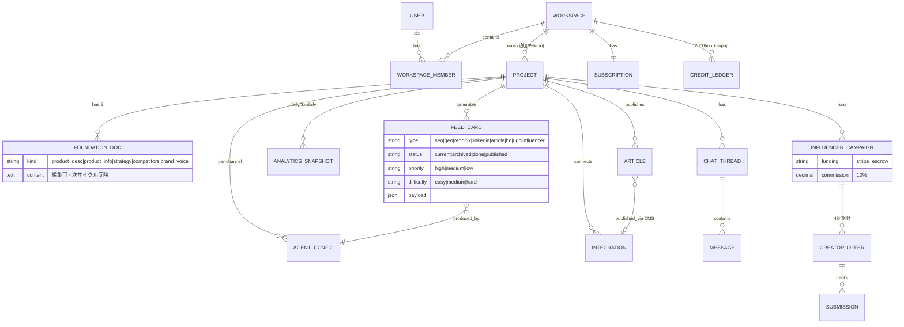

# Teardown: Okara (The AI CMO)
- source_urls: [https://okara.ai/, https://okara.ai/docs/ (llms.txt経由全ページ), https://okara.ai/pricing, https://okara.ai/api/changelog, https://okara.ai/subprocessors, 各agentページ, blog, 第三者レビュー約20本]
- date: 2026-08-13
- user_requirements: Okaraの「100倍いいもの」を作る。用途は自社C向けAIプロダクト ShogunAI (syogun.com, macOSアプリ, $62/mo, 英日グローバル) と他プロダクトのグロース。グローバル覇権が目標。外販も予定するが、まず内部で使い続けて磨き込む (internal-first)。競合を徹底的に洗い出し、機能・精度すべて同等以上にしてから細部を磨く。
- confidence: high (docs全文・changelog生JSON・アプリi18n文字列・料金ページ実測 + 第三者レビュー・競合20社調査でクロスチェック済み。詳細は research/ 配下4ファイル)

## 1. Positioning

**Okara**: 「配布(ディストリビューション)に困っているブートストラップ創業者・極小チームのために、$99/月で10チャネルのマーケティング実行(SEO/GEO/Reddit/X/LinkedIn/HN/記事/UGC動画/インフルエンサー/テクニカルSEO)を毎日ドラフトし、承認一つで配信するAI CMO」。

実態(レビュー総合): 「CMO(戦略家)」ではなく「監督必須の下書きマシン」。戦術実行の下位70%を置き換える力の増幅装置としては有用だが、コンテンツ品質(slop)・戦略の浅さ・クローズドさが弱点。会社はシンガポール2〜10名、チャット製品からのピボット、ブートストラップ疑い(「$12M調達」説は信頼性低の単一ソースのみ [ASSUMED: 誤情報])。

**我々(WasabiGTM)が作るもの**: 「プロダクトの内部文脈(コード・分析・ユーザーの声)まで接続し、配信結果から学習して自己改善する、成果に閉じたグロースOS」。まずShogunAIのグロース装置として internal-first で磨き、その実績ごと外販する。[USER-REQ]

## 2. Feature Map

★=Okaraのコア機能

- **オンボーディング / 戦略レイヤー**
  - ★ URL入力→公開ページ自動クロール→3〜8分で稼働
  - ★ Foundation Documents 5種の自動生成 (Product Description / Product Information / Marketing Strategy / Competitor Analysis / Brand Voice)。全て編集可、保存即反映(次の6時間サイクルから)
  - Website Refresh (サイト変化の自動検知→文書再生成、手動は24h1回)
- **実行レイヤー: 10エージェント** (日次デリバリー: SEO/GEO fix 2件、記事1本、Reddit機会2件、ツイート1本、LinkedIn 1本)
  - ★ SEO Agent — 日次監査(on-page / キーワードギャップ / コンテンツ機会 / CWV+robots/sitemap/llms.txt)。Fix適用は CMS直接 / GitHub PR / 手動 の3経路
  - ★ GEO Agent — ChatGPT/Perplexity/Gemini/Claude の4エンジン。GEOスコア0-100、AI Readiness、Top Prompts(引用されるべき購買意図クエリ)、日次fix 2件
  - ★ Articles Writer — キーワードギャップ+AI引用機会からトピック選定、6記事タイプ、800-2,000語、**Humanizing工程**、OG画像生成、CMS自動公開
  - ★ Reddit Agent — subreddit日次スキャン+関連性フィルタ+コミュニティ調ドラフト。**投稿は常に手動**(BAN回避を明示ポジショニング)
  - ★ X Agent — 日次ドラフト(5カテゴリローテ)。OAuth即時投稿。**各ドラフト独立生成=編集から学習しない**
  - LinkedIn Agent — founder-voice投稿5タイプ。個人/会社ページ
  - Hacker News Agent — Show/Ask HN 3バリエーション、ハイプ語禁止ルール、推奨時刻ガイダンス。提出は手動
  - Coding Agent — SEO/GEO指摘→リポジトリ文脈でコード生成→**GitHub PR**(自動マージなし、1プロジェクト1リポ)
  - UGC Video Agent — チャット内で生成(9:16/16:9/1:1、最大720p、12秒=96cr)。プロンプト記述型
  - Influencer Agent — ブリーフ→5軸スコアリング→承認→**Stripe前払いエスクロー**→48h受諾期限→提出物トラッキング→自動ペイアウト。総額の10%手数料。現在Xのみ
- **分析レイヤー**
  - ★ Analytics 5タブ: SEO(ヘルススコア/CWV/Issueリスト+Fixボタン) / Links(被リンク健全性) / GEO / Technical / Traffic(GA+GSC、1日3回同期)
- **インターフェース**
  - ★ Agents Feed — 日次機会カードキュー(9種、難易度・優先度バッジ、Post/Copy/Publish/Archive)= 中核画面
  - ★ Talk to AI CMO — チャットハブ(@メンションでコンテキスト指定、CoT表示トグル、毎朝daily rundown)
  - WhatsApp / Telegram / Slack(実装済み未発表)からの双方向チャット
  - Writing Instructions(エージェント別のトーン・キーワード・地域指定)
  - 共有ダッシュボード(read-onlyリンク)、チーム招待($20/席)
- **統合**: WordPress/Webflow/Framer/Sanity(CMS публish)、X/LinkedIn(OAuth投稿)、GitHub(PR)、GA/GSC、WhatsApp/Telegram/Slack。TikTok/IG「Soon」
- **収益化**: Free(5cr) / $99〜129月額(2,000cr) / クレジット従量(記事18、動画60+等) / トップアップ / 追加サイト$99/席$20 / Influencer 10%

**Okaraに無いもの(競合・レビュー調査より)**: メール/ライフサイクル、広告運用、ASO、TikTokオーガニック、リファラル/バイラルループ、公開API/MCP/Zapier、一括エクスポート、成果からの学習ループ、SOC 2、マルチクライアント(代理店)対応。

## 3. Screen Inventory

| ID | Screen | Purpose | Key UI | Nav to |
|---|---|---|---|---|
| SCR-001 | Landing / URL入力 | 起点。URL入力でサインアップ | URL入力、Get started free | SCR-002 |
| SCR-002 | オンボーディング解析ターミナル | クロール&文書生成のライブ進捗演出 | ストリーミングログ、進捗、リトライ | SCR-003 |
| SCR-003 | ダッシュボードシェル / AI CMO Terminal | 全体ナビ+エージェント活動ログ | 4パネルナビ、プロジェクトスイッチャー、活動ストリーム | SCR-004〜011 |
| SCR-004 | Company パネル | 5 Foundation Documents の閲覧・編集 | 文書エディタ、Save/Download/Copy/Undo、翻訳、Sync from website | SCR-003 |
| SCR-005 | Analytics — SEO | 検索健全性 | スコア0-100、CWV、Issueリスト+Fixボタン | SCR-010(fix→カード) |
| SCR-006 | Analytics — Links | 被リンク健全性 | 参照ドメイン、スパムスコア、4階層 | — |
| SCR-007 | Analytics — GEO | AI検索可視性 | GEOスコア、AI Readiness、Top Prompts、競合比較 | SCR-010 |
| SCR-008 | Analytics — Technical | 技術監査 | TTFB等、OG検証、見出し構造 | SCR-010 |
| SCR-009 | Analytics — Traffic | GA/GSCデータ | セッション、CTR、top queries | — |
| SCR-010 | Agents Feed | 日次機会キュー(中核) | 9種カード、Current/Archived、優先度・難易度、Post/Publish/Archive、Writing Instructions | SCR-011, 外部 |
| SCR-011 | Talk to AI CMO | チャットハブ | @メンション、添付、CoTトグル、daily rundown、UGC生成 | SCR-018 |
| SCR-012 | Settings | 12セクションの設定 | AI CMO/Websites/Credits/Agents/Integrations/Team/… | SCR-013〜015 |
| SCR-013 | Settings — Team | 招待・権限 | 招待リンク(7日)、Admin/Member、$20/席 | — |
| SCR-014 | Integrations | 統合管理 | Connect/Disconnect、Auto-publishトグル、Field mapping | — |
| SCR-015 | Credits | 残高・トップアップ | 残高、20%警告、Top up | SCR-016 |
| SCR-016 | 課金モーダル | アップグレード | $99(打消$129)、Monthly/Yearly | — |
| SCR-017 | 接続モーダル群 | WhatsApp/Telegram/Slack接続 | 認証コード、Add to Slack | — |
| SCR-018 | Influencerキャンペーン | 進行管理 | ブリーフ、ショートリスト承認、Stripe Checkout、提出物表 [ASSUMED: 構成] | — |
| SCR-019 | 共有ダッシュボード | read-only外部共有 | 閲覧専用ビュー | — |
| SCR-020 | オンボーディング(アップグレード時) | Paid文書の追加生成 | 進捗ターミナル | SCR-003 |

## 4. User Flows

- **UF-01 オンボーディング**: SCR-001(URL入力) → SCR-002(3-8分解析) → SCR-004(5文書確認・編集) → SCR-010(初日のフィード)
- **UF-02 日次承認ループ(コア)**: 6時間サイクルでカード生成 → SCR-010(フィード確認) → カード展開 → 編集 → Post/Publish(X/LinkedIn/CMSは接続済なら即時) or Copy(手動) → Archive。毎朝 SCR-011 に daily rundown
- **UF-03 SEO/GEO fix**: SCR-005/007(Issue検出) → Fixボタン → (a)CMS直接適用 (b)Coding Agent→GitHub PR→人間マージ (c)手動手順
- **UF-04 記事公開**: SCR-010(記事カード) → プレビュー・編集 → CMS選択(Published/Draft) → 自動公開(OG画像・メタ込み)
- **UF-05 インフルエンサーキャンペーン**: SCR-011(ブリーフ対話) → SCR-018(ショートリスト承認) → Stripe前払い → 自動アウトリーチ(48h期限) → 提出物承認 → 自動ペイアウト

## 5. Data Model (estimated)

裏側 [ASSUMED]: Supabase(Postgres)+Upstash(Redis/ベクターDB/キュー)。6時間サイクルのcronジョブがエージェント実行をキューイング。推論はReplicate経由のオープンウェイト系モデル中心(subprocessor表にOpenAI/Anthropic不在)→ slop批判の一因と推定。

## 6. Pricing

- **Free**: 5クレジット(一回限り)、SEO+X Agentのみ、ホームページ監査のみ。クレカ不要
- **AI CMO plan**: 定価$129/mo($107.50/mo年払) → 現在$99/moプロモ。2,000クレジット/月(繰越なし)。全10エージェント+auto-publish+チーム
- **クレジット単価**: 記事18 / SEO・GEO分析10 / HN 9 / Reddit 8 / LinkedIn 7 / X 5 / UGC動画60〜(12秒720p=96)
- **トップアップ**(無期限): 860cr=$45 / 2,000cr=$90 / 4,600cr=$180
- **アドオン**: 追加サイト$99/mo、追加メンバー$20/mo、Influencerキャンペーン額の10%
- 4ヶ月で3回価格変更($249→$129/249の2階層→$99プロモ)=PMF模索中。クレジット不透明さと「14日で枯渇」がユーザー不満の筆頭

## 7. AI-Native Opportunities

Okaraの各機能を「AIが主語」に置き換え、SHOGUN的観点(コンテキストレイヤー接続・自律実行・passive capture)で再設計する:

1. **Foundation Docs → Living Context Layer**: Okaraは公開ページのスクレイプ1回きり+手動Refresh。我々はMCPで内部ソース(自社リポジトリ、PostHog/分析、Stripe/売上、App Store レビュー、サポート会話、changelog、実ユーザーの声)に常時接続し、戦略文書が毎日自動で「生きて」更新される。ポジショニングの根拠が「ホームページに書いてあること」ではなく「ユーザーが実際に言っていること・使っている機能」になる。slop問題の根治はここ。
2. **Agents Feed → 成果クローズドループ**: Okaraは「各ドラフト独立生成、編集から学習しない」と明記(docsで確定)。我々は配信物すべてにUTM/計測を自動付与し、GSC/X analytics/GA/コンバージョンを自動回収→「どの角度・フック・チャネルが効いたか」を週次で自己分析→次の生成に反映。エージェントが自分のKPIを持ち、自分で振り返る。「投稿数」でなく「獲得ユーザー数」が主語。
3. **Reddit/コミュニティ → 文化メモリ+founderボイスクローン**: Okaraはsubredditルールのサマリ止まり。我々は各コミュニティの過去の「勝ちパターン投稿」(何が上位に来て何がBANされたか)をpassive captureして文化モデルを構築、さらにfounder本人の過去投稿(X/Reddit/HN)から文体を学習。「AIが書いた宣伝」ではなく「その人がそのコミュニティに書く文章」を出す。GummySearch亡き後のオーディエンスリサーチ(ペインポイント発掘)も統合。
4. **GEO → 計測でなく実行**: 市場全体(Profound/Peec/Otterly)が計測止まり、Okaraもfix提案+スニペット止まり。我々は llms.txt/schema/コンテンツ再構成をPRとして自律実行し、引用シェアの前後比較まで自動検証する「実行するGEO」。AthenaHQの+45%が精度バー。
5. **Coding Agent → グロースエンジニアリング・エージェント**: OkaraはメタタグPR止まり。我々は自社リポジトリ全体を理解するエージェント(Claude Agent SDK)が、比較LP・use-caseページ・プログラマティックSEOページの生成、A/Bテスト実装、リファラル機構の実装まで行う。「マーケコンテンツ」と「プロダクト側のグロース機能」の境界を消す。
6. **B2Cグロース・エージェント群(Okara空白 × 市場空白)** [USER-REQ]: ASO(App Storeキーワード・スクショ文言の継続最適化)、Product Hunt/HNローンチ運用、TikTokトレンド検知→フェイスレス動画、バイラル/リファラルループ設計。競合20社+チャンネル特化調査でもAIネイティブ王者不在の3領域。ShogunAIの実需(macOSアプリ、prosumer、英日)にそのまま重なる。
7. **多言語ネイティブ展開** [USER-REQ]: Okaraは UI 17言語だが生成は実質英語圏向け。我々は最初から「同じ主張を各言語ネイティブの角度で」(翻訳でなく各市場のコミュニティ文化・検索行動に合わせた生成)。日英2市場で内部検証→外販時の差別化。
8. **品質ゲート(anti-slop パイプライン)**: 生成→複数視点の敵対的レビュー(ジェネリック度・事実性・ブランドボイス適合・コミュニティ適合)→スコア未達は自動リライト→人間承認。Okara最大の弱点「slop」への直接回答。フロンティアモデル(Claude)前提で、Okaraのオープンウェイト系運用と品質差を作る。
9. **MCPネイティブ / オープン設計**: Okaraは意図的クローズド(API/MCP/エクスポート無し、コンポーザビリティ3/10)。我々はMCPサーバーとして自身を公開し(承認キュー・戦略文書・計測がツールとして叩ける)、Claude Code等から操作可能に。技術層(=ShogunAIの顧客層でもある)への訴求と、内製ツール→外販の移行を滑らかにする。

## 8. Copy / Drop / Change

### Copy(同等以上に実装する — Okaraの正解)
| 対象 | 理由 |
|---|---|
| URL入力→数分で稼働のオンボーディング演出(ターミナルUI) | 「魔法の瞬間」。レビューでも最も称賛される点 |
| Foundation Documents 5種(編集可・全生成の根拠) | 戦略→実行の一貫性を作る正しい構造。中身の深さで勝つ |
| Agents Feed(日次カードキュー+承認UX+優先度/難易度) | human-in-the-loopの正解形。中核画面 |
| 日次デリバリー約束(「毎日◯件」の明確さ) | 習慣化とリテンションの核 |
| Reddit「投稿は常に手動」原則 | BANリスク回避。ReplyGuy型の自動投稿は失敗パターンと市場が証明済み |
| テクニカルSEO→GitHub PR(JSインジェクションでなく実コード) | 技術的に正しく、エンジニアの信頼を得る差別化。我々はさらに深く |
| チャットハブ(@メンション・daily rundown)+Slack/Telegram面 | 「どこにいてもCMOと話せる」体験 |
| HNエージェントのハイプ語禁止・投稿時刻ガイダンス | コミュニティ文化への敬意の設計 |
| 記事のHumanizing工程 | anti-slopの萌芽。我々は多段品質ゲートに拡張 |

### Drop(捨てる — Okaraの失敗/我々に不要)
| 対象 | 理由 |
|---|---|
| クローズド設計(API/MCP/エクスポート無し) | 最大の批判点の一つ。MCPネイティブで逆張り |
| 不透明なクレジット制(内部利用フェーズでは丸ごと不要) | 「14日で枯渇」がチャーン筆頭因。internal-firstでは課金機構自体が不要 [USER-REQ]。外販時も透明な従量制を設計し直す |
| Influencerエスクロー/マーケットプレイス | 決済・返金・仲介の運用負債が重い。MVP対象外、外販フェーズで再評価 |
| UGC動画の自前生成パイプライン | Creatify/HeyGen/MirageのAPI組み合わせで十分。自前開発は負け筋(Icon崩壊が実例) |
| ライフタイムディール/誇大マーケ(「$14,000/月を$99で」) | 信頼毀損。実測成果で語る |
| マルチモデルチャット製品の残滓(モデルセレクタ等) | ピボット前の遺物。不要 |
| B2B SaaS 26業種向けuse-caseテンプレート | 汎用SMB向けの拡げ方はしない。自社プロダクト群に深く最適化 [USER-REQ] |

### Change(変えて勝つ)
| 対象 | Okara | 我々 |
|---|---|---|
| 文脈の深さ | 公開ページスクレイプ1回 | 内部データ常時接続のLiving Context(§7-1)[USER-REQ] |
| 学習 | ドラフト独立生成・学習なし | 成果クローズドループ(§7-2) |
| 品質 | オープンウェイト系+humanizer1段 | フロンティアモデル+敵対的品質ゲート(§7-8) |
| ターゲット | B2B SaaS/SMB汎用 | **B2C/prosumerグロース**(ASO・PH/HNローンチ・TikTok・リファラル)を第一級市民に [USER-REQ] |
| 言語 | UI17言語・生成は英語中心 | 日英ネイティブ生成、市場別文化適応 [USER-REQ] |
| 提供形態 | クローズドSaaS | internal-first内製ツール→MCPネイティブSaaS化 [USER-REQ] |
| Coding Agent | メタタグPR | グロースエンジニアリング(LP/pSEO/A-Bテスト/リファラル実装)(§7-5) |
| 分析 | チャネル別表示のみ | 施策→獲得ユーザーのアトリビューション一気通貫 |
| Reddit調査 | キーワード監視 | 文化メモリ+ペインポイント発掘(GummySearch代替)+founderボイス(§7-3) |

## 9. MVP Scope Proposal(2週間)

**原則 [USER-REQ]**: internal-first。最初のユーザーは自分たち。ShogunAIのグロースに今日から使えるものを最短で出し、毎日使いながら磨く。課金・マルチテナント・管理画面の作り込みは外販フェーズまで排除。

**MVP(2週間)に入れる**:
1. **Context Layer**: ShogunAIの文脈取り込み(syogun.com + shogun-brandスキル + 手動投入資料 + GSC/GA接続)→ Foundation Docs 5種生成・Markdown編集可能(Gitで版管理)
2. **日次Agents Feed**(Web UI 1画面 + Slack/Telegram通知): 以下5エージェントのカード生成
   - X Agent(founderボイス学習込み、日英)
   - Reddit Agent(監視+ペインポイント発掘+ドラフト、投稿は手動)
   - SEO/GEO Agent(syogun.com監査、llms.txt/schema生成、fix提案→PR)
   - Articles/LP Writer(比較ページ・use-caseページ、品質ゲート付き)
   - HN/Product Hunt ローンチ支援(ドラフト+タイミング)[USER-REQ: C向けローンチ動線]
3. **品質ゲートv1**: 生成→敵対的レビュー(ジェネリック度/事実性/ブランドボイス)→スコア→未達リライト
4. **成果ループv1**: UTM自動付与+GSC/X指標の日次取り込み+週次振り返りレポート
5. **配信**: X OAuth投稿、GitHub PR(サイト修正)、Markdown/コピペ出力。CMS自動公開は自社サイト構成に合わせて1本
6. **アーキテクチャ**: Claude Agent SDK + MCPネイティブ(自身をMCPサーバー化)、Postgres、6時間サイクルのジョブ実行

**MVP後(フェーズ2以降)**: ASOエージェント、TikTok/UGC動画(外部API)、LinkedIn、リファラルループ設計、メール/ライフサイクル、マルチプロダクト対応→外販版(課金・チーム・API公開)

## Appendix: Open Questions [要確認]

**ユーザー判断が必要(Stage 2の前に確認したい)**:
1. **ShogunAIの現フェーズ**: プレローンチ(Early Access募集中)か、ローンチ済みか。既存のグロース資産(Xアカウント、ブログ、GSC/GA設定、メールリスト)はどこまであるか → MVPエージェントの優先順位が変わる(プレローンチならPH/HN/ウェイトリスト系を最優先)
2. **対象プロダクトの数**: 「その他のグロース」とは具体的にどのプロダクトか(WasabiGTM外販以前に内部で複数プロダクトを回すか)→ マルチプロジェクト設計をMVPに入れるかの判断
3. **MVPのインターフェース**: Webダッシュボードまで作るか、まずは「Slack/Telegram通知+承認」+「Claude Code/CLIから操作」の最小構成で始めるか
4. **投稿主体**: founder個人アカウント(X/Reddit/HN)で運用するか、プロダクト公式アカウントか、両方か → ボイス学習と OAuth 設計に影響
5. **外部APIの課金許容**: UGC動画(Creatify/HeyGen)、SEOデータ(Ahrefs/DataForSEO等)、Reddit公式API、インフルエンサーDB等の月額コスト上限
6. **日英の優先度**: 最初から両言語で配信するか、まず英語グローバルに集中するか

**調査上の未解決(実装中に検証)**:
7. Okaraの現行プラン構成($99は恒久プロモかLite/Pro復活か)— 外販価格設計時に再確認
8. バックリンク/キーワードデータのソース(Okaraは非公開)— 我々はDataForSEO/GSC中心で設計予定 [ASSUMED]
9. Reddit公式APIの商用契約コスト(GummySearchが閉鎖に至った条件)— Reddit Agentの実装方式(公式API vs 読み取りスクレイプ+手動投稿)に影響
10. Okaraの「6時間サイクル」の実装詳細(全エージェント一斉か channel別か)— 我々のジョブ設計の参考値
